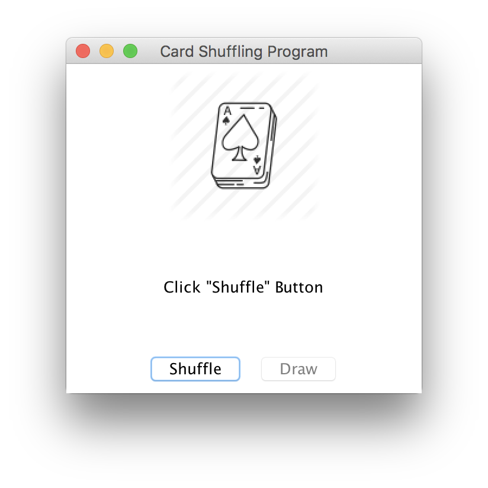
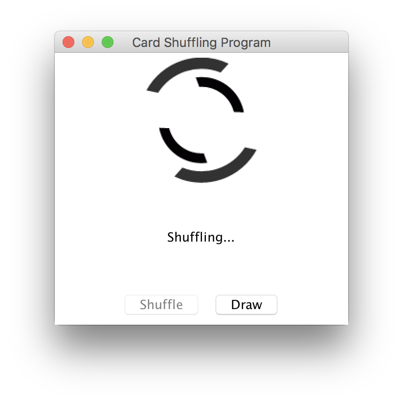

# Card-Shuffling-Program
A card shuffling program that takes cards from an image folder and shuffles their order.
You are able to click the Draw button only 52 times since that is the amount of cards there are.
The program also displays the name of the card after it has been displayed.

There are duplicate images in the folder which will cause a mismatch in the naming of the card.

# Screenshots

